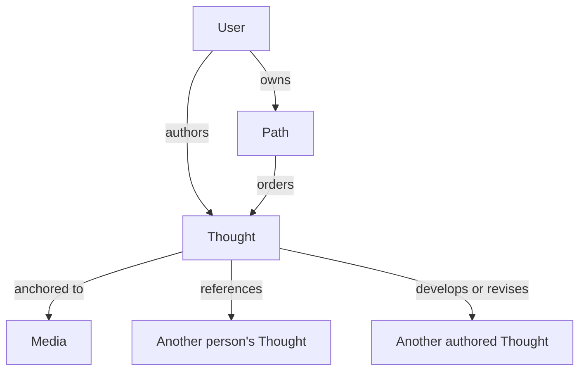

# Product Model

## Purpose

This document defines the core product objects, their relationships, and the rules that protect authorship and Map meaning.

## Model overview

## User

A User is the owner of a personal Map and public profile.

Minimum public identity:

- Handle.
- Display name.
- Profile image or visual mark.
- Short identity line.
- Featured media selected from works already present in the Map.

The profile should communicate taste and thought without relying on audience size, consumption totals, or achievement statistics.

## Media

Media is a shared record for a created work. The first version supports two types only.

### Book

- Title.
- Author or authors.
- Publication year when known.
- Cover when a trustworthy source is available.
- Optional identifiers such as ISBN.

### Film

- Title.
- Director or directors.
- Release year when known.
- Poster when a trustworthy source is available.
- Optional external catalogue identifiers.

### Shared rules

- The platform stores metadata, not the work itself.
- The same work is shared across users rather than duplicated into each Map.
- Missing niche works can be created as provisional records.
- A provisional record needs type, title, creator, and optional year.
- Duplicate records must be mergeable without losing attached Thoughts.
- Missing artwork uses a deliberately designed typographic tile.
- The system must not invent fake cover or poster art.
- Users should not freely replace shared artwork in the first version.

## Thought

A Thought is the primary authored content object.

It represents something a person noticed, questioned, interpreted, or concluded in response to created media.

### Required properties

- Author.
- Compact core statement.
- Status.
- One primary Media anchor before publication.
- Creation and publication timestamps.

### Optional properties

- Expanded body.
- Precise reference such as chapter, passage description, scene, or timestamp.
- Additional Media anchors.
- Reference to another Thought.

### Size

Every Thought needs a compact statement that remains readable as a Map node. An optional body may add depth, but a Thought should not require essay-length writing.

### Grounding rule

- A Draft may temporarily have no Media anchor.
- A Published Thought must have at least one Book or Film anchor.
- A quotation without the user's interpretation is not a Thought.

### One work and bridge Thoughts

A Thought begins with one primary work. Adding another work turns it into a bridge across media.

"Connection" is therefore an interaction and presentation, not a competing authored content type. A multi-media Thought contains the actual human meaning that connects its works.

## Thought lifecycle

### Draft

- Private to the author.
- Freely editable.
- May be unattached while in a capture inbox.
- Appears distinctly on the author's private Map layer as soon as it is captured.
- Never appears on the public Map or public profile.
- Cannot receive public social interaction.

### Published

- Public and eligible for profile, Map, Media, Theme, and discovery surfaces.
- Must have a Media anchor.
- May receive Saves, Appreciations, Comments, and Thought references.

### Correction

Published wording may be corrected for spelling, grammar, clarity, or inaccurate reference details without changing the underlying claim.

Published corrections should retain prior versions for trust. The interface may present this simply as `Edited · View history`.

### Intellectual change

A changed position is a new Thought, not a rewrite of the original.

Supported relationships should begin with:

- `develops`
- `revises`
- `contradicts`
- `clarifies`
- `references`

This makes intellectual development visible rather than erasing it.

## Theme region

A Theme is an emergent region of related Thoughts, Media, and authored relationships in one person's Map. It is a way of recognizing and later naming a pattern; it is not a conventional graph node that the user manually creates and connects.

Examples:

- Nostalgia as self-deception.
- Performance as survival.
- Memory as an unreliable kindness.

### Theme-region rules

- A Theme region belongs to one User's Map.
- Its shape arises from that User's authored content and relationships.
- It is not a global tag.
- A user does not file a Thought into a Theme as a required creation step.
- A region may exist visually before it has a name or durable public identity.
- The system may later surface a possible region, but the user must choose whether to name, rename, dismiss, or eventually reshape it.
- The system must not automatically publish a Theme name as part of the user's identity.
- Public similarity does not merge two users' Themes into a canonical concept.

### Theme spaces

A future public Theme space is a generated discovery lens that brings nearby, user-recognized Map regions together through exact language, shared media, explicit links, and carefully suggested similarity.

The Theme space is not itself a globally owned content node.

## Personal Map

The Map is a generated view, not a separately authored content object.

### Membership

A User's Map contains:

- Their authored Thoughts.
- The Books and Films anchoring those Thoughts.
- Authored relationships among Thoughts and Media.
- Emergent regions and user-approved names when the Map has earned them.

It does not contain another person's Thought as one of the User's own nodes.

### Cross-person references

When a User publishes a Thought referencing another person's Thought:

- The new Thought appears normally in its author's Map.
- It quietly indicates that it references another author.
- The external Thought remains owned by and located in the original author's Map.
- The relationship is credited, bidirectional, and navigable.
- The default personal Map need not render the external Thought as a large node.
- A wider social layer may reveal the complete cross-map relationship on demand.

### Layout

- Generated automatically from actual relationships.
- Stable enough that the Map feels familiar over time.
- Supports zooming and cluster focus.
- Allows intuitive movement and light control such as pinning important nodes and featuring regions.
- Distinguishes casual spatial movement from authored semantic relationships.
- Does not require full manual node placement.

## Library

The Library is private utility, not public identity.

It may contain:

- Books and Films saved for later.
- Other people's Thoughts saved for later.
- Unattached Draft Thoughts awaiting a Media anchor.

The Library has no ratings or public counts. Saved Media and other people's saved Thoughts do not influence the owner's Map. The owner's Draft Thoughts may appear only on the private Map layer; publication is still required before they affect the public Map.

## Comment

A Comment is contextual conversation attached to one Thought.

- It has an author and body.
- It belongs to exactly one Thought.
- It may have one level of reply.
- It is visible when that public Thought is opened.
- It has no standalone page.
- It does not appear in Maps, profiles, Themes, search, or discovery.
- It requires no Media anchor because it inherits the Thought's context.
- It may optionally be developed into a new anchored Thought referencing the original.

Comments are not graph nodes.

## Path

A Path is an optional guided journey through existing Thoughts.

- Author.
- Title.
- Short introduction or thesis.
- Ordered Thought references.
- Visibility.
- Optional featured Map region or Theme when those exist.

A Path does not duplicate its Thoughts or Media. It is linear in its first form. Visitors may leave the Path at any point to explore the surrounding Map.

Paths are conceptually accepted but not required to prove the first core loop.

## Objects deliberately excluded

The foundation does not include:

- Rating.
- Review.
- Collection.
- Global Topic or canonical Theme.
- Standalone Post without a Media anchor.
- Public consumption log.
- Achievement, streak, or score.
