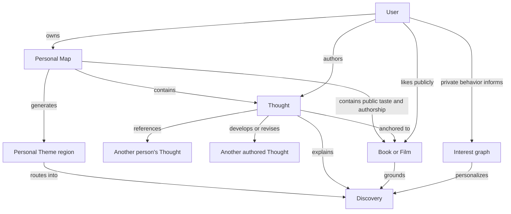

# Product model

## Purpose

This document defines Contour's core objects, relationships, and boundaries. It
protects deliberate public expression from private behavioral inference while
allowing both to improve discovery.

## Model overview

## User

A User has a public profile and Map plus a separate private interest graph.

Minimum public identity:

- Handle.
- Display name.
- Profile image or visual mark.
- Short identity line.
- Deliberately public Likes, Published Thoughts, connections, and visible Theme
  regions as they accumulate.
- Optional featured Media selected from the public Map.

The profile communicates taste and thought without relying on audience size,
consumption totals, achievement statistics, or public vote scores.

## Media

Media is a shared record for a created work. The first version supports two
types only.

### Book

- Title.
- Author or authors.
- Publication year when known.
- Cover when a trustworthy source is available.
- Optional identifiers such as ISBN.

### Film

- Title.
- Director or directors.
- Release year when known.
- Poster when a trustworthy source is available.
- Optional external catalogue identifiers.

### Shared rules

- The platform stores metadata, not the work itself.
- The same work is shared across Users rather than duplicated into each Map.
- Missing niche works can be created as provisional records.
- A provisional record needs type, title, creator, and optional year.
- Duplicate records must be mergeable without losing Likes, Thoughts, Saves,
  Bookmarks, or discovery provenance.
- Missing artwork uses a deliberately designed typographic tile.
- The system must not invent fake cover or poster art.
- Users should not freely replace shared artwork in the first version.

## Like

A Like is a deliberate public claim that a Book or Film belongs in the User's
taste.

- It may add the shared Media record to the User's public Map without requiring
  a Thought.
- It does not claim authorship, explain why the User likes the work, create a
  semantic edge, or prove completion.
- It is distinct from a private Save, a rating, and an upvote on someone else's
  contribution.
- Removing a Like removes the taste-only membership unless the same Media still
  belongs through a Published Thought, connection, or explicit feature.
- Public aggregate Like counts are hidden or strongly de-emphasized.

Like is the lowest-friction public Map contribution. Thoughts and connections
add meaning rather than being prerequisites for a Map to exist.

## Thought

A Thought is the primary authored content object.

It represents anything a person wants to express in response to created media:
a reaction, question, interpretation, disagreement, memory, comparison, or
conclusion. The author has freedom over register and length within practical
product limits.

### Required properties

- Author.
- Free-form core statement.
- Status.
- One primary Media anchor before publication.
- Creation and publication timestamps.

### Optional properties

- Expanded body.
- Precise reference such as chapter, passage description, scene, or timestamp.
- Additional Media anchors.
- Reference to another Thought or personal Theme region.

### Form

Every Thought needs a compact statement that remains usable in discovery and
on the Map. An optional body may add depth. Contour does not require a rating,
summary, verdict, theme field, or academic review structure.

### Grounding rule

- A Draft may temporarily have no Media anchor.
- A Published Thought must have at least one Book or Film anchor.
- A quotation without the User's own expression is not a Thought.

### One work and bridge Thoughts

A Thought may begin with one primary work and stand on its own. Adding another
work turns it into a bridge across Media.

Connection is therefore an interaction and presentation, not a competing
authored content type. A multi-Media Thought contains the human meaning that
makes the relationship useful for discovery.

## Thought lifecycle

### Draft

- Private to the author.
- Freely editable.
- May be unattached while in a capture inbox.
- Appears distinctly on the author's private Map layer as soon as it is
  captured.
- Never appears on the public Map, profile, search, or recommendations.
- Cannot receive public social interaction.

### Published

- Public and eligible for Map, profile, Media, Theme, search, and discovery
  surfaces.
- Must have a Media anchor.
- May receive private Bookmarks, personalized Votes, Comments when enabled, and
  credited Thought references.

### Correction

Published wording may be corrected for spelling, grammar, clarity, or
inaccurate reference details without changing the underlying claim.

Published corrections should retain prior versions for trust. The interface
may present this as `Edited · View history`.

### Intellectual change

A changed position is a new Thought, not a rewrite of the original.

Supported relationships should begin with:

- `develops`
- `revises`
- `contradicts`
- `clarifies`
- `references`

This makes intellectual development visible rather than erasing it.

## Personal Theme region

A Theme is a generated region of related public Likes, Thoughts, Media, and
authored relationships in one person's Map. It is a discovery lens, not a
conventional node or manually assigned global tag.

Examples:

- Nostalgia as self-deception.
- Performance as survival.
- Memory as an unreliable kindness.

### Formation

- A Theme appears only when the public Map has enough substance and coherence
  to support a meaningful region.
- Evidence may include multiple works, multiple Thoughts, explicit
  relationships, and recurring language or ideas.
- Spatial proximity alone is insufficient.
- Exact thresholds remain an empirical product question.

### Naming and control

- The system generates the Theme name when the formation threshold is met.
- The interface must distinguish generated naming from the User's authored
  words.
- A generated Theme is visible by default when its Map is public.
- The owner may rename, hide, dismiss, or later restore the Theme.
- Hiding or dismissing a Theme does not delete the underlying Likes, Thoughts,
  Media, or connections.
- A visible Theme is searchable when its Map is public.

### Network meaning

- A Theme region belongs to one User's Map.
- It is not a canonical global topic.
- A User does not manually file every Thought into it as required creation
  labor.
- Similar personal Themes may be retrieved together without being merged into
  one objective concept.

## Personal Map

The Map is a generated, shapeable view of one User's deliberate public taste
and expression. It is not a separately authored database or the only way to
use Contour.

### Public membership

A User's public Map may contain:

- Books and Films they deliberately Like;
- their Published Thoughts;
- Media anchoring those Thoughts;
- their explicit relationships among Thoughts and Media;
- visible generated Theme regions; and
- credited routes to external material without importing its authorship.

It does not contain:

- Draft Thoughts;
- private Saves or Bookmarks;
- passive searches, views, dwell, or recommendation history;
- another person's Thought as if the User authored it; or
- hidden or dismissed Theme regions.

### Layers

- **Taste layer:** deliberately Liked Books and Films.
- **Authored layer:** Published Thoughts and explicit connections.
- **Generated layer:** layout and visible Theme regions.
- **External layer:** credited references and navigable social context.

These layers must remain visually and semantically distinct.

### Layout

- Generated automatically from public membership and actual relationships.
- Stable enough that the Map feels familiar over time.
- Supports zooming and region focus.
- Allows intuitive movement and light control such as pinning, featuring, and
  hiding generated regions.
- Distinguishes spatial movement from authored semantic relationships.
- Does not require full manual node placement.

## Private interest graph

The interest graph is private system state used to personalize discovery. It
is not a public Map layer and must not be presented as the User's identity.

Possible inputs include:

- Likes, Published Thoughts, and explicit connections;
- private Saves and Bookmarks;
- follows and personalized Votes;
- searches and selected recommendation reasons;
- repeated visits to Media, Thoughts, Theme regions, Maps, or people;
- opens, skips, and other interaction signals; and
- similarity to aggregate patterns across other Users.

Signal strength must reflect intent. Authored expression, Likes, Saves, follows,
and repeated deliberate actions carry more weight than an impression, one view,
or raw time spent.

### Boundary

- Passive or private activity never silently changes the public Map.
- Recommendation explanations must not reveal sensitive private activity to
  another User.
- A User needs proportionate controls over personalization history, correction,
  and reset before production launch.
- Recommendation logic may retrieve candidates from the interest graph, but it
  must show human evidence from public content whenever available.

## Private Library

The Library is private utility.

It may contain:

- Books and Films Saved for later;
- Bookmarked Thoughts, connections, or personal Theme regions;
- Draft Thoughts; and
- saved routes back to another person's Map.

Saving or Bookmarking does not publish, notify the source author by default,
add an item to the public Map, create a semantic edge, or imply agreement.

## Cross-person references

When a User publishes a Thought referencing another person's Thought or Theme
region:

- the new Thought appears normally in its author's Map;
- it identifies the external source and author;
- the external material remains owned by and located with its original author;
- the relationship is credited and navigable; and
- the default personal Map need not render the full external branch as large
  local nodes.

Saving a branch privately and referencing it publicly do not import it into the
User's authored Map. Whether a future User can add a live or copied external
branch to their Map remains an unresolved owner decision.

## Vote

A Vote is private feedback about whether a Thought, connection, or discovery
route fits the viewer's taste.

- An upvote means the viewer wants more like this.
- A downvote means the interpretation or route is not for this viewer.
- A Vote is not a judgment of objective truth or quality.
- A Vote does not alter the target author's Map.
- Downvotes do not notify the author.
- Public totals and global scoreboards are excluded.
- Voting may influence personal relevance, but the system should still preserve
  some varied and opposing perspectives.

The Social Contract owns detailed presentation and ranking effects.

## Follow

Following a person prioritizes routes through their public taste, Thoughts,
connections, Themes, and Map. It does not copy their material into the
follower's Map.

## Comment

A Comment is optional contextual conversation attached to one Thought.

- It has an author and body.
- It belongs to exactly one Thought.
- It may have one level of reply.
- It is visible only when that public Thought is opened.
- It has no standalone discovery page and is not a Map node.
- It may optionally be developed into a new anchored Thought referencing the
  original.

Whether Comments belong in the first shared discovery phase remains open.

## Path

A Path is a possible guided journey through existing Thoughts, Media, or Theme
regions.

- Author.
- Title.
- Short introduction or thesis.
- Ordered credited references.
- Visibility.

A Path does not duplicate its sources. Paths remain conceptually compatible
with Contour but are not required for the next discovery proof.

## Objects deliberately excluded

The foundation does not include:

- a mandatory or aggregate Rating;
- a public popularity score;
- a canonical global Theme or Topic object;
- a standalone public Post without a Book or Film anchor;
- a public consumption log;
- an achievement, streak, or engagement score;
- a semantic edge created only by spatial movement; or
- an AI-authored Thought presented as human expression.
